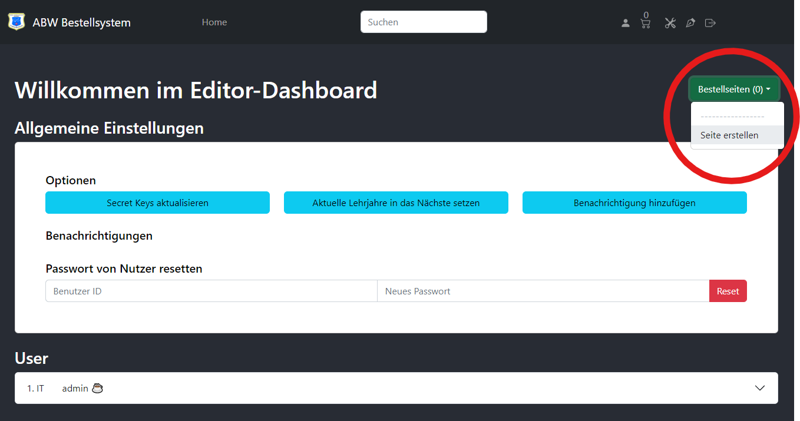

# ABW Bestellsystem

<p align="center">
   
</p>


Thanks for using our opensource version of the ABW Bestellsystem. This is a web application to manage orders for Azubis. It is written in ReactJS and NodeJS and uses MongoDB as database.

## Features
- Multiple Sites for mutiple locations to order from
- Multiple Products per Site
- Order by Email
- "Runners" that can pick up orders
- "Admins" that can manage the their group
- "Editors" that can manage the whole system

## Supported languages
- German 
- English (in progress) 

# Quick Start

1. Download the opensource_install.sh
2. Run the script with `sudo bash opensource_install.sh`
3. Select 1) to download the latest version & configure your installation
4. done

### After first login:

After the first login you will be redirected to the editor page. You need to create a new Site and add some Items to it.


# Additional Configuration

## Using a reverse proxy with nginx

```
server {

   ...

   # subfolder for the frontend
   # example: /order
   location /<your_frontend_url> {
      proxy_pass http://127.0.0.1:6969/;
      proxy_set_header Host $host;
      proxy_set_header X-Real-IP $remote_addr;
      proxy_set_header X-Forwarded-For $proxy_add_x_forwarded_for;
   }


   # subfolder for the api
   # example: /order/api/
   location /<your_api_url>/ {
      proxy_pass http://127.0.0.1:42069/;
      proxy_set_header Host $host;
      proxy_set_header X-Real-IP $remote_addr;
      proxy_set_header X-Forwarded-Proto $scheme;
      proxy_set_header X-Forwarded-For $proxy_add_x_forwarded_for;
   }
}
```

## Create a backup

Execute the following command to create a backup:
```bash
docker exec <mongodb container> sh -c 'mongodump --authenticationDatabase admin -u <user> -p <password> --db <database> --archive' > <backup file>
```
For example:
```bash
docker exec order_mongodb_1 sh -c 'mongodump --authenticationDatabase admin -u orderadmin -p Password123 --db orderdb --archive' > order.dump
```

## Restore a backup

Execute the following command to restore a backup:
```bash
docker exec -i <mongodb container> sh -c 'mongorestore --authenticationDatabase admin -u <user> -p <password> --db <database> --archive' < <backup file>
```
After that you need to check the database if there is a duplicate entry for the editor collection. If so, you need to delete the duplicate entry (Most of the time its the first entry that needs to be deleted).
To do so, execute the following command:

### Access the container
```bash
docker exec -it <mongodb container> bash
```
### Access the mongo shell
```bash
mongo -u <user> -p <password> --authenticationDatabase admin
```
### Select the database
```bash
use <database>
```
### Find the duplicate entry
```bash
db.editors.find()
```
### Delete the duplicate entry
```bash
db.editors.deleteOne({ _id: ObjectId("<id>") })
```

For example:
```bash
docker exec -i order_mongodb_1 sh -c 'mongorestore --authenticationDatabase admin -u orderadmin -p Password123 --db orderdb --archive' < order.dump
```
